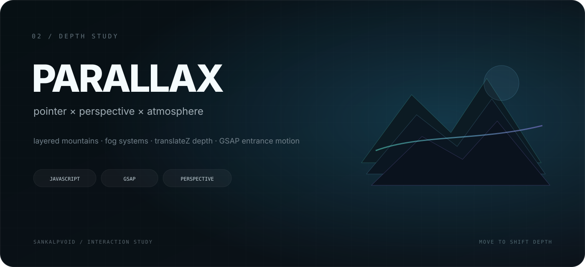

  

 

# Parallax Website

**[Live Demo ↗](https://parallax-website-beta-pearl.vercel.app/)**

A layered motion study built around depth, atmosphere and pointer-driven interaction.

The scene is assembled from individual mountain, fog and lighting layers. Each one moves at its own speed and perspective depth, creating a responsive sense of space while **GSAP** handles the opening choreography.

## What I explored

- multi-layer pointer-driven parallax
- perspective and `translateZ` depth
- rotation based on cursor position
- independent movement speeds for scene layers
- GSAP entrance choreography
- responsive depth behavior across viewport sizes

## Working set

`HTML` · `CSS` · `JavaScript` · `GSAP` · `Parallax` · `Perspective`

## Why this exists

The goal was to understand how a flat browser canvas can feel spatial — using **motion hierarchy, depth cues and layered composition** rather than heavy 3D tooling.

---

interaction study / <a href="https://github.com/sankalpvoid">sankalpvoid</a>
